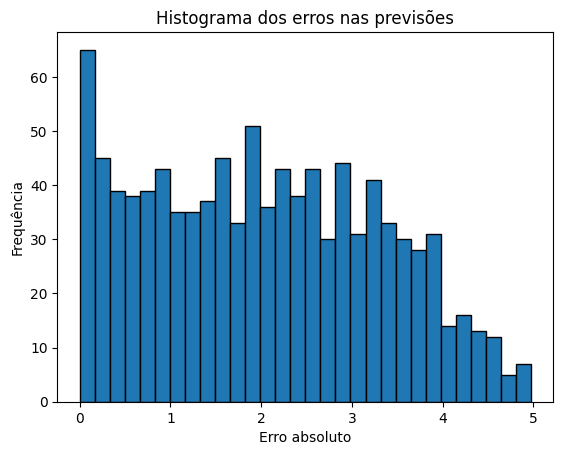

# Sistema de Predição de Avaliações de Filmes usando SVD

Este projeto utiliza a decomposição em valores singulares (SVD - Singular Value Decomposition) para prever as avaliações de filmes com base em um conjunto de dados de avaliações de usuários. A implementação prevê as avaliações faltantes e gera um histograma dos erros entre as predições e os valores reais.

## Funcionalidades

- Carrega o conjunto de dados de avaliações de filmes no formato CSV.
- Constrói uma matriz de avaliações onde os usuários estão nas linhas e os filmes nas colunas.
- Realiza uma decomposição SVD para reduzir a dimensionalidade da matriz e gerar predições.
- Introduz ruído nas avaliações para testar a capacidade de predição do modelo.
- Calcula os erros entre as avaliações reais e as predições.
- Gera um histograma mostrando a distribuição dos erros.

## Uso
O código principal consiste em:

- **Função `svd(U, S_diag, Vt, i, j)`**:
  Calcula a predição de uma avaliação para a posição `(i, j)` usando a decomposição SVD.

- **Função `main()`**:
  - Carrega os dados e cria a matriz de avaliações.
  - Aplica a decomposição SVD com 20 autovalores.
  - Itera sobre um número de predições, introduzindo ruído e comparando os valores reais com as predições.
  - Gera e exibe um histograma dos erros.

## Exemplos

O histograma gerado ao final da execução mostrará a distribuição dos erros absolutos entre as predições e os valores reais.

